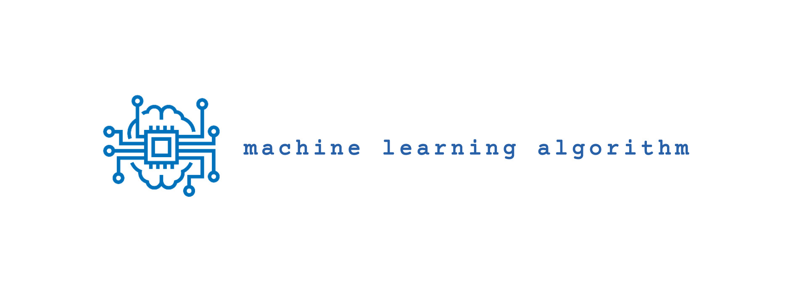

<h1 align="center">Machine Learning Algorithm</h1>

This repository contains implementations of various machine learning algorithms from scratch in python. Thiimplementations are designed to be educational, offering clear insights into the workings of each algorithm.

### Algorithms

- KMeans Clustering
- Neural Network
- Logistic Regression
- Linear Regression
- K-Nearest Neighbors
- Random Forest

## Contributions

Feel free to adjust this description further to highlight any unique aspects of your implementations or additional information you want to provide to users and contributors.

## Author

